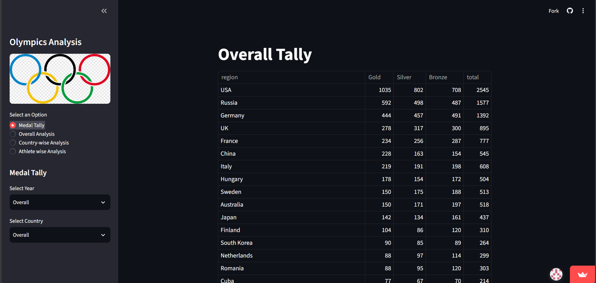
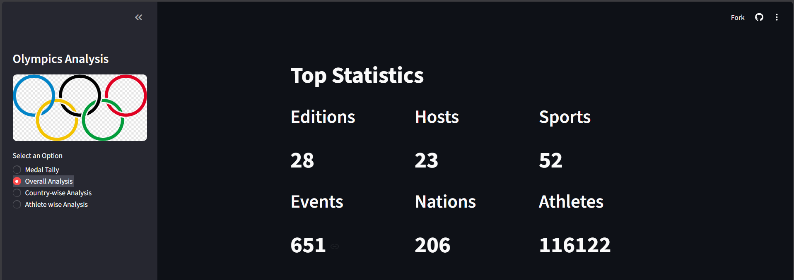
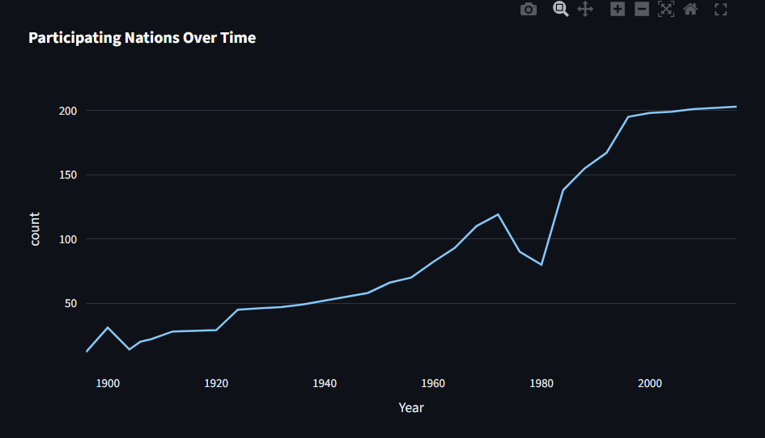
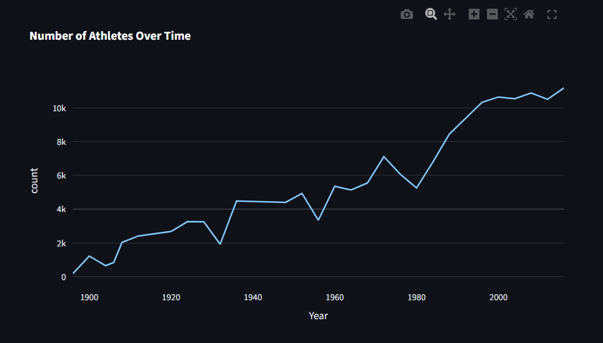
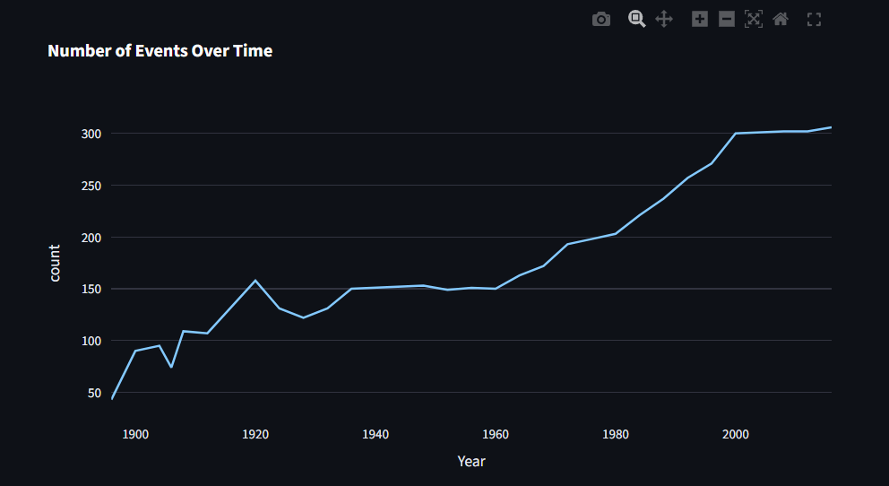
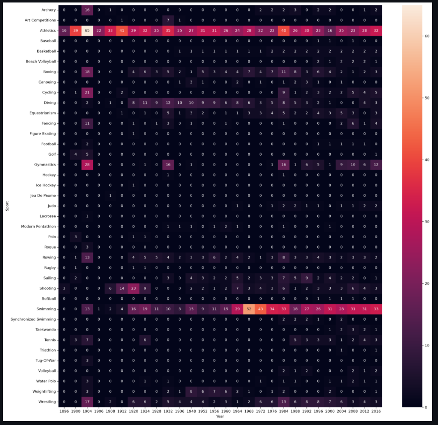

# 🏅 Olympics Data Analysis Dashboard

An interactive **Olympics Data Analysis Dashboard** built using **Python, Streamlit, Pandas, Plotly, Matplotlib, and Seaborn**. The application enables users to explore historical Summer Olympics data through interactive visualizations, medal statistics, country-wise analysis, and athlete performance insights. The dashboard preprocesses Olympic athlete and NOC datasets, performs feature engineering, and presents analytical results in a clean, user-friendly interface. :contentReference[oaicite:0]{index=0} :contentReference[oaicite:1]{index=1}

---

## 🚀 Features

- 🏆 Overall Medal Tally
- 🌍 Country-wise Medal Analysis
- 📅 Year-wise Medal Analysis
- 📈 Participation Trends Over Time
- 🏟️ Overall Olympics Statistics
- 🔥 Most Successful Athletes
- 📊 Interactive Visualizations
- 🎛️ Streamlit Sidebar Filters

---

# 🛠️ Tech Stack

| Category | Technologies |
|----------|--------------|
| Programming Language | Python |
| Web Framework | Streamlit |
| Data Processing | Pandas, NumPy |
| Data Visualization | Plotly Express, Matplotlib, Seaborn |
| Dataset | Athlete Events Dataset, NOC Regions Dataset |
| IDE | VS Code / PyCharm |
| Version Control | Git & GitHub |

---

## 🌐 Live Demo

🚀 Explore the deployed dashboard here:

**🔗 [Olympics Data Analysis Dashboard](https://olympics-data-analysis-aklr6bso86th8bh6argjuh.streamlit.app/)**

> Experience the interactive dashboard without any local setup.

# 📂 Project Structure

```text
Olympics-Analysis/
│
├── main.py
├── helper.py
├── preprocessor.py
├── athlete_events.csv
├── noc_regions.csv
├── images
│
└── README.md
```

---

# 📊 Dashboard Modules

## 🏅 Medal Tally

Users can explore medal counts based on:

- Overall Olympics
- Specific Year
- Specific Country
- Country in a Particular Olympic Edition

### 📷 Output

<!-- Add Screenshot -->


---

## 🌍 Overall Analysis

Provides important Olympic statistics including:

- Total Editions
- Host Cities
- Sports
- Events
- Athletes
- Participating Nations

### 📷 Dashboard

<!-- Add Screenshot -->


---

## 📈 Participation Trends

Interactive trend analysis of:

- Nations over time
- Events over time
- Athletes over time

### 📷 Output

<!-- Add Screenshot -->



---

## 🔥 Sports Event Heatmap

Displays the number of events conducted in every sport across different Olympic editions.

### 📷 Output

<!-- Add Screenshot -->



---

# 📈 Key Insights

- Analyze medal-winning trends across Olympic editions.
- Compare country performances over different years.
- Track participation growth of nations and athletes.
- Identify the most successful athletes in Olympic history.
- Visualize the evolution of sports and events over time.
- Explore historical Olympic data through interactive dashboards.

---


---

# 🔮 Future Scope

- Add Olympic Games filtering by season (Summer/Winter).
- Include predictive analytics for future medal counts.
- Integrate geographical maps for medal distribution.
- Add advanced athlete comparison and performance analytics.

---

